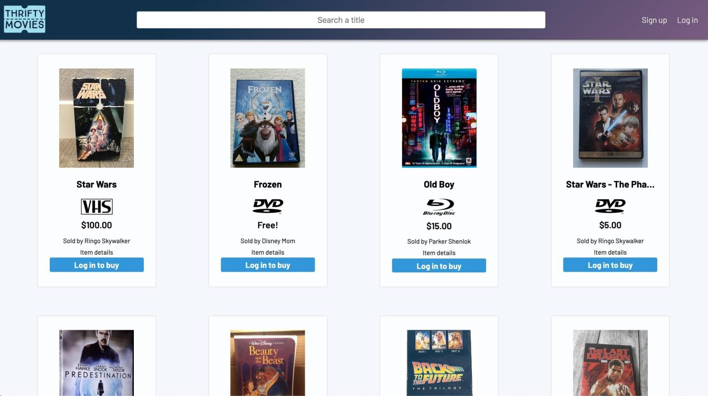
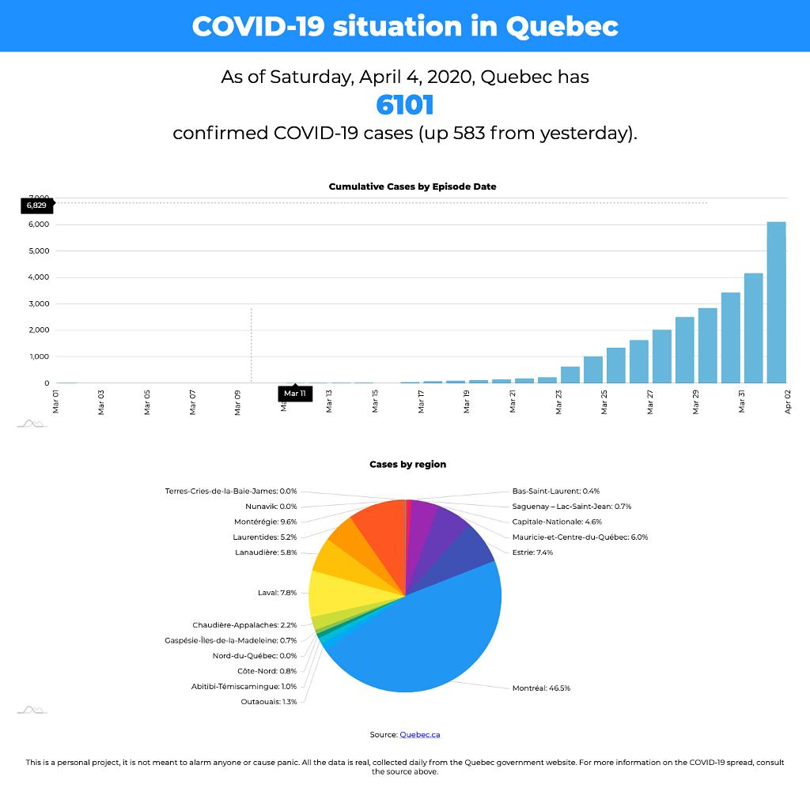

## Hi there 👋🏼

I'm Tiago. I was a marketing professional once. But before that, I was a copywriter and campaing planner. And I also dable in design. 👨🏻‍💻Now I code.

**🔎 Looking for a job!**

My background informs my web developer persona in many ways:
- 🖥️ I value greatly a good UI and UX.
- 🌱 I understand some projects will only bear fruit in the future.
- 🍃 I know things change. A lot. Suddenly. I can deal with it.
- ⚙️ I can see how the small cog is important for the big machine.

### Some projects

**Adventure Game**

A fun little game created in vanilla Javascript as part of a class project. [You can play it here!](https://tiagomota79.github.io/adventure-game/) On top of the code, I designed some of the assets - though most are from public available libraries. [Check the repo here.](https://github.com/tiagomota79/adventure-game)

**Thrifty Movies**

This used-movies-focused marketplace was developed using Javascript, React, React-Redux, React-Router on an Express server with Multer, and styled with Styled Components. It allows users to upload images for the movies they would like to sell, filling a user-friendly form to create a new item to sell. [Check the repo here.](gitbub.com/tiagomota79/thrifty-movies)

**Quebec Covid-19 tracker**

A two-part simple app [(live here!)](https://qc-covid19-tracker.herokuapp.com) to track the evolution of the Covid-19 in Quebec in a infographic interface. Information is scraped from the government website and stored in a MongoDB database. [Check the scraper repo here,](https://github.com/tiagomota79/qc-covid19-scraper) and the [tracker repo here.](https://github.com/tiagomota79/qc-covid19-tracker)

### Find me here
💼 [Linkedin](https://www.linkedin.com/in/tiagomot/)

<!--
**tiagomota79/tiagomota79** is a ✨ _special_ ✨ repository because its `README.md` (this file) appears on your GitHub profile.

Here are some ideas to get you started:

- 🔭 I’m currently working on ...
- 🌱 I’m currently learning ...
- 👯 I’m looking to collaborate on ...
- 🤔 I’m looking for help with ...
- 💬 Ask me about ...
- 📫 How to reach me: ...
- 😄 Pronouns: ...
- ⚡ Fun fact: ...
-->
